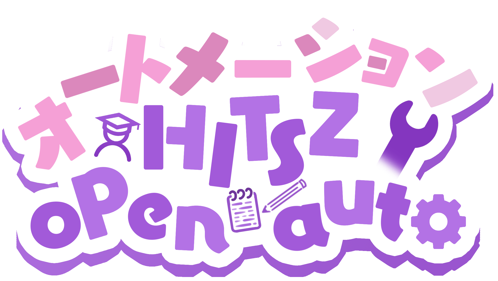

<h3 align="center">
	 
</h3>

## 👋关于我们

我们是来自哈尔滨工业大学（深圳）的学生，致力于分享对同学有帮助的课程攻略。

### 🛠️我们的项目

[HITSZ 课程攻略共享计划](https://hoa.moe)：

- 课程文档：每门课的授课老师风格、作业参考答案、实验指南以及考试复习题……
- 博客：保研，留学，考研和技术分享……
- 信息聚合：校内热门群聊，常用站点……

### 📖欢迎参与

如果你有可供分享的资料，欢迎创建 Pull Request 为对应课程的仓库增加新内容；如果对仓库中的内容有疑问或建议，可以通过创建 Issue 的方式提出。

具体方式可以阅读我们的 [《参与指南》](https://wiki.hoa.moe/)。

### 🙋‍♀️加入我们

如果你是哈工大（深圳）的学生并且有兴趣成为核心维护者，请发邮件至 [hi@hoa.moe](mailto:hi@hoa.moe) 联系我们。

### ❤️感谢名单

由衷感谢每一位 HITSZ OpenAuto 的参与者:

<!-- contributors:start -->
<!-- Generated by scripts/sync_contributors.py; do not edit this block. -->

 

 

 

 

 

 

 

 

 

<!-- contributors:end -->

目前仅记录在 GitHub 组织下参与的同学，但是我们同样感谢曾经通过邮件/ OpenAuto 仓库参与的同学！
